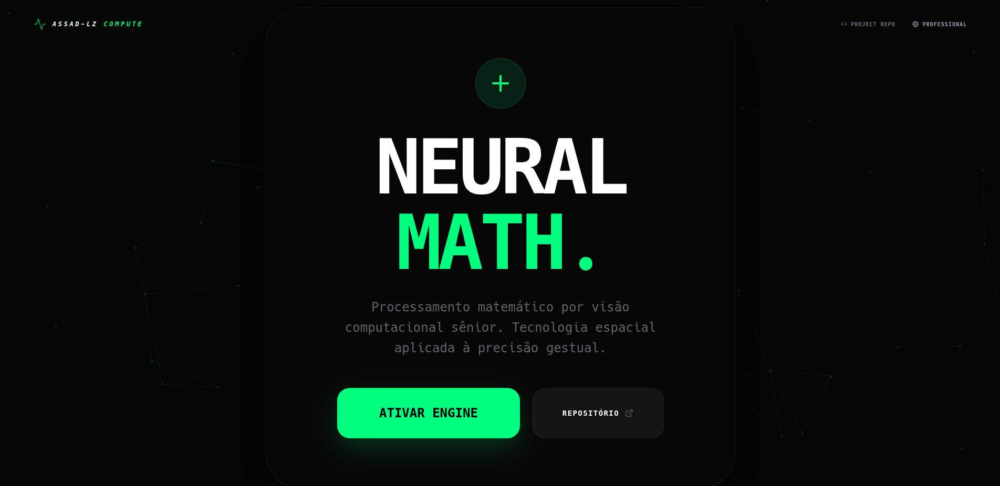
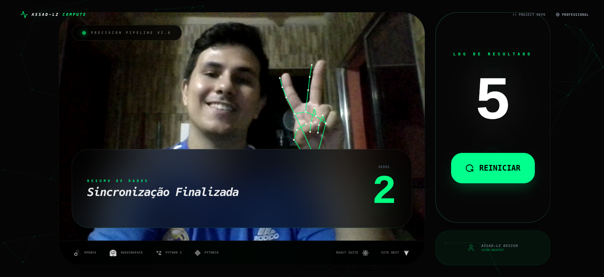

# 🧮 AI Computational Vision Calculator - Neural Math

<p align="center">
  
  
  
  
  
  
  
</p>

## 🚀 O Projeto
Uma calculadora futurista baseada em gestos que utiliza **Visão Computacional Sênior** para reconhecer a contagem de dedos e realizar operações matemáticas em tempo real. O sistema foi migrado de um motor Python local para uma aplicação Web de alta performance, garantindo privacidade total (processamento 100% no cliente) e uma experiência de usuário (UX) de nível industrial.

### 🖼️ Demonstração Visual

#### Tela Inicial do Sistema


#### Sistema em Execução (Soma em Tempo Real)


### ✨ Funcionalidades Principais
- **Reconhecimento 3D**: Lógica de profundidade espacial para contagem precisa de dedos.
- **Sincronização por Fases**: Ciclo inteligente de 7 segundos para captura de operandos.
- **Interface Premium**: Design Glassmorphism com fundo interativo em malha geométrica.
- **Privacidade por Design**: Processamento local via WebAssembly (WASM), nenhum dado de imagem sai do seu navegador.
- **Multi-Plataforma**: Funciona em qualquer navegador moderno com suporte a WebGL/WASM.

---

## 🛠️ Stack Tecnológica

### Core AI & Vision
- **Python 3.10+**: Prototipagem e motor lógico original.
- **MediaPipe Hands**: Engine de rastreio de landmarks de alta fidelidade.
- **OpenCV**: Processamento de imagem e filtragem espacial.
- **PyTorch / HuggingFace**: Modelagem e extração de features para reconhecimento.

### Frontend (Modern Stack)
- **React 19 + TypeScript**: Estrutura robusta e tipagem estática.
- **Vite**: Build system ultra-rápido para próxima geração.
- **Tailwind CSS v4**: Estilização baseada em tokens de design.
- **Framer Motion**: Micro-interações e animações de interface.
- **GSAP / Canvas API**: Fundo dinâmico com malha de partículas.

---

## 🏃 Como Rodar o Projeto

### Pré-requisitos
- [Node.js](https://nodejs.org/) (Versão 18+)
- [Python 3.10+](https://www.python.org/) (Opcional, para rodar os scripts locais)

### Passo a Passo

1. **Clone o repositório:**
   ```bash
   git clone https://github.com/Assad-Lz/Reconhecimento-e-Soma-de-Digitos-com-Vis-o-Computacional.git
   cd Reconhecimento-e-Soma-de-Digitos-com-Vis-o-Computacional
   ```

2. **Instale as dependências do Frontend:**
   ```bash
   cd frontend
   npm install
   ```

3. **Inicie o servidor de desenvolvimento:**
   ```bash
   npm run dev
   ```

4. **Acesse no navegador:**
   Abra [http://localhost:5173](http://localhost:5173) e conceda permissão de câmera para iniciar a experiência.

---

## 🧠 Lógica de Reconhecimento Sênior

A precisão do sistema baseia-se no cálculo da **Distância Euclidiana 3D** entre os marcos (landmarks) da mão:
- **Dedos**: Verificação da distância entre o pulso e as pontas dos dedos vs as juntas PIP (Fator 1.1x).
- **Polegar**: Cálculo de abertura lateral em relação à base do indicador (Fator 0.48x).

---

## 👤 Autor
Desenvolvido por **Assad-Lz** - Engenheiro de Sistemas focado em IA e Visão Computacional.

[](https://www.linkedin.com/in/yssaky-assad-luz-4562b6236/)
[](https://github.com/Assad-Lz)

---
*Este projeto foi construído com foco em inovação e performance computacional.*
